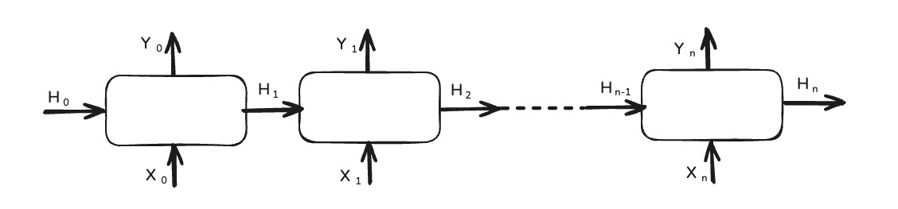
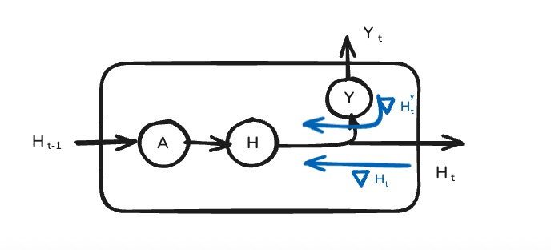

# rnn-patterns - test
# RNN Coding Patterns
## Math Behind RNNs:

### Figure 1  

The illustration above shows a time‑unrolled representation of the RNN to make the computation steps easier to follow. Inputs enter the RNN cell from the bottom, and at each time step the cell produces an output. Uppercase variables with subscripts represent tensors, and the dimensions shown in parentheses indicate the shape of each corresponding parameter.

$$
\begin{aligned}
A (-, h)= X (-, i) @ W_x (i, h) + H_{t-1} (-, h) @  W_h (h, h) +  B_a (-, h) \quad (1)\\
H_t (-, h) = tanh(A) \quad (2)\\
\hat{y} (-, o) = H_t (-, h) @ W_y (h, o) + B_y (-, o)  \quad (3)
\end{aligned}
$$

### Figure 2

This diagram above illustrates the internal flow within the RNN cell. The quantities $A$, $H_t$, $\hat{y}$ correspond to the operators defined in the equations above. The gradients are computed as follows. Let $L$ be the loss, $\nabla L = |\hat{y} -y|^2$, then $\nabla L$ can be written as follows:

$$ 
\begin{aligned}
\nabla \hat{y} = \frac{\partial L}{\partial \hat{y}} = 2 \cdot |\hat{y} - y|
\end{aligned}
$$

Similarly, we write $\nabla H_t$, and $\nabla A$ using the chain rule as follows:

$$ 
\begin{aligned}
\nabla H_t = \frac{\partial L}{\partial y} \cdot \frac{\partial y}{\partial H_t}= \nabla y \cdot W_y 
\end{aligned}
$$

From equation $(2)$, 

$$
\begin{aligned}
\frac{\partial H_t}{\partial A} = (1 - H_t^2) \\
\nabla A = \frac{\partial L}{\partial H_t} \cdot \frac{\partial H_t}{\partial A}= \nabla H_t \cdot (1-Ht^2) \\
\end{aligned}
$$

Similarly, we write $\nabla B_y$, $\nabla W_x$, $\nabla W_h$,  and $\nabla B_a$ as follows:

$$
\begin{aligned}
\nabla B_y = \frac{\partial L}{\partial \hat{y}} \cdot \frac{\partial \hat{y}}{\partial B_y}= \nabla H_t \cdot 1 \\
\nabla W_x = \frac{\partial L}{\partial A} \cdot \frac{\partial A}{\partial W_x} = \nabla A \cdot X \\
\nabla W_h = \frac{\partial L}{\partial A} \cdot \frac{\partial A}{\partial W_h} = \nabla A \cdot H_{t-1} \\
\nabla B_a = \frac{\partial L}{\partial A} \cdot \frac{\partial A}{\partial B_a} = \nabla A \cdot 1 \\
\end{aligned}
$$

The above equations can be written in the tensor form as follows:

$$
\begin{aligned}
\nabla H_{total} (-, h) = \nabla H_t[i] (-, h) + \nabla H_t^y[i] (-, h) \\
\nabla A (-. h) = \nabla H_{total} (-, h) \odot (1 - H_t[i]^2) (-, h) \\
\nabla y (-, o) = 2 \cdot (\hat{y} - y) (-, o) \\
\nabla B_y (-, o) \mathrel{+}= \nabla_y (-, o) \\
\nabla W_y (h, o) \mathrel{+}= \nabla H_t[i].T (h, -) \cdot \nabla y (-, o) \\
\nabla W_x (i, h) \mathrel{+}= \nabla X[i].T (i, -) \cdot \nabla A (-, h) \\
\nabla W_h (h, h) \mathrel{+}= \nabla A.T (h, -) \cdot \nabla H_t[i] (-, h) \\
\nabla B_a (-, h) \mathrel{+}= \nabla_y A(-, h) \\
\nabla H_t^y[i] (-, h) = \nabla_y A(-, h) \cdot W_h (h, h)\\
\end{aligned}
$$

## Code Organization